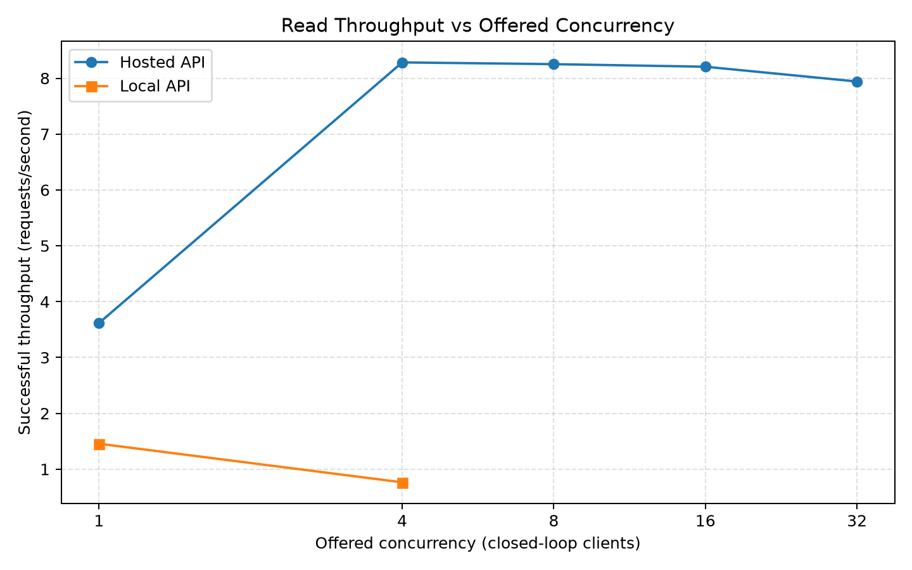
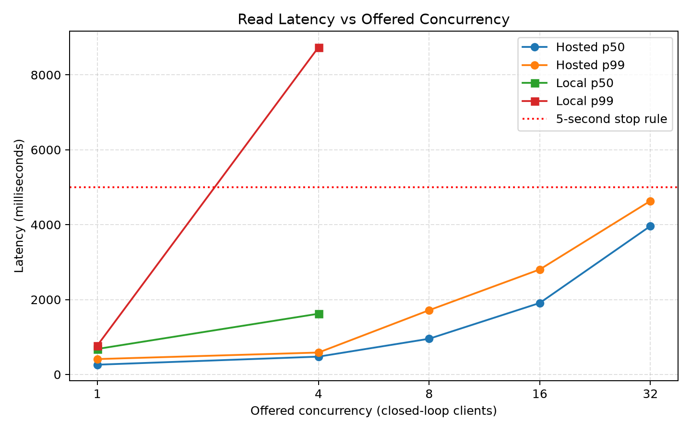
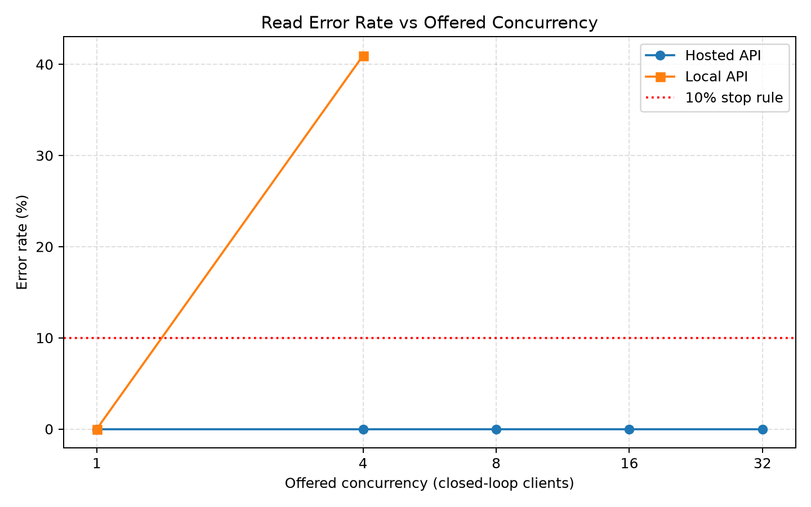

# M2 - Baseline Performance

Team members: Vishnupriya Atheti and Tyler Van Beek

## 1. System under test

Lagniappe Sign-Up is an event-management application. The architecture remained:

```text
Browser or load generator -> Django REST API -> PostgreSQL
```

- Repository: <https://github.com/Tyler-Van-Beek/CSCE-553-Team>
- Branch: `priya/m2-baseline-performance`
- Hosted application deployment commit: `f8048cb`
- Final measurement-data checkpoint: `37d9e81`
- Hosted URL: <https://lagniappe-priya-m2.onrender.com>
- Hosted API: Render Free, 0.1 CPU, 512 MB RAM, Virginia
- Database: Supabase PostgreSQL through its session pooler
- Hosted server: Gunicorn using its default worker count
- Local server: Django 5.1.6 `runserver` on Windows at `127.0.0.1:8000`

The hosted and local tests used the same 50-event Supabase dataset. The same token worked in both environments. The list payload was 10,500 bytes hosted and 10,491 bytes locally. Application code was unchanged during testing; later commits changed only measurement tools, results, and documentation. No cache, queue, replica, CDN, paid upgrade, or architecture change was added.

## 2. Pre-measurement model and prediction

The timestamped prediction was committed in `m2/results/prediction.md` before any 60-second test.

Assumptions: 10% of registered users active in the peak hour, 6 actions per active user per hour, 80% reads and 20% writes, 20,000 modeled bytes/read, 1,000 bytes/write, one copy, and 0.25-second planning mean latency. Decimal MB/GB are used; indexes and backups are excluded from the numerical storage estimate.

```text
Peak RPS = active users * actions/hour / 3600
Write RPS = peak RPS * 0.20
Storage/day = write RPS * 86,400 * 1,000 bytes
Bandwidth = peak RPS * 16,200 bytes
In flight = peak RPS * 0.25 seconds
```

| Registered users | Active users | Peak RPS | Write RPS | Storage/day | Bandwidth | In flight |
|---:|---:|---:|---:|---:|---:|---:|
| 10,000 | 1,000 | 1.67 | 0.33 | 28.8 MB | 27 KB/s | 0.42 |
| 1,000,000 | 100,000 | 166.67 | 33.33 | 2.88 GB | 2.70 MB/s | 41.67 |
| 100,000,000 | 10,000,000 | 16,666.67 | 3,333.33 | 288 GB | 270 MB/s | 4,166.67 |

The predicted first observable limit was saturation of the small Render API process or its request queue: throughput would flatten and p99 would rise before PostgreSQL exhausted its connections. The rationale was the 0.1-CPU API service and Django persistent connections (`CONN_MAX_AGE=600`).

## 3. Method

Tools: Python 3.14.6, Django 5.1.6, the supplied standard-library `load_baseline.py`, curl, Supabase SQL Editor/Observability, Windows Task Manager, and Matplotlib 3.11.0. The driver was adapted to send Django's `Token` authorization scheme. `--write-method` was later added so mixed writes could use PATCH without growing the dataset; this changed tooling only.

| Workload | Endpoint | Authentication |
|---|---|---|
| Cold start and control | `GET /health/` | None |
| Read | `GET /api/events` | Token |
| Write | `PATCH /api/events/10` | Token |
| Mix | Read plus PATCH | Token; configured random 80%/20% |

PATCH repeatedly updated one synthetic event with a fixed body, keeping the event count and read payload stable. The raw rows do not tag the randomly selected method, so the mix is reported as configured 80/20 rather than an exact observed count.

Official stages used 10 seconds warm-up, 60 seconds measurement, closed-loop clients, and at least 30 seconds recovery. The read sweep used c1, c4, c8, c16, and c32 while healthy. Stop rules were error rate above 10%, p99 above 5 seconds, or dominant failures. Hosted cold start was excluded from warm percentiles.

## 4. Results

### Cold start and control

The hosted cold `GET /health/` returned HTTP 200 in **46.482 seconds**. A later warm request took **0.266 seconds**.

| Series | c | Attempts | Success RPS | p50 ms | p95 ms | p99 ms | Max ms | Errors |
|---|---:|---:|---:|---:|---:|---:|---:|---:|
| Hosted health | 2 | 908 | 15.114 | 127.70 | 164.97 | 223.52 | 1,142.21 | 0% |
| Local health | 2 | 12,499 | 208.306 | 4.92 | 26.31 | 28.14 | 57.41 | 0% |

Local health throughput was about 13.8 times higher. Health does not query PostgreSQL, so it isolates a large host/network/framework difference without database work.

### Hosted read sweep

| c | Attempts | Success RPS | p50 ms | p95 ms | p99 ms | Max ms | Errors |
|---:|---:|---:|---:|---:|---:|---:|---:|
| 1 | 218 | 3.617 | 260.98 | 320.23 | 411.04 | 1,335.90 | 0% |
| 4 | 500 | 8.283 | 476.06 | 490.45 | 585.77 | 1,361.90 | 0% |
| 8 | 502 | 8.252 | 953.81 | 977.32 | 1,716.47 | 1,907.74 | 0% |
| 16 | 509 | 8.206 | 1,908.97 | 1,990.17 | 2,804.10 | 2,808.92 | 0% |
| 32 | 513 | 7.941 | 3,963.09 | 4,154.67 | 4,634.17 | 4,962.84 | 0% |
| 32 repeat | 510 | 7.877 | 3,966.34 | 4,115.50 | 4,402.44 | 4,965.54 | 0% |

The hosted knee was approximately c4. From c4 to c32, throughput decreased while p99 rose from 586 ms to 4.63 seconds. The c32 repeat reproduced the result. c64 was not run because the required sweep ended at c32 and it was already near the stop threshold.

### Local read sweep

| c | Attempts | Successes | Success RPS | p50 ms | p95 ms | p99 ms | Max ms | Errors |
|---:|---:|---:|---:|---:|---:|---:|---:|---:|
| 1 | 88 | 88 | 1.456 | 680.82 | 749.38 | 772.23 | 793.03 | 0% |
| 1 repeat | 87 | 87 | 1.449 | 678.67 | 713.86 | 951.46 | 1,231.38 | 0% |
| 4 | 83 | 49 | 0.765 | 1,622.06 | 8,520.05 | 8,738.54 | 8,957.94 | 40.96% |

The c1 repeat matched the first c1 stage. At c4, both stop rules fired and all 34 failures were HTTP 500. Therefore, higher local stages were not run. Local database-backed reads were slower than hosted c1 despite much faster local health, consistent with the laptop-to-Supabase network path and the different local server.

### Write and mixed workloads

| Series | Workload | c | Attempts | Successes | RPS | p50 ms | p95 ms | p99 ms | Max ms | Errors |
|---|---|---:|---:|---:|---:|---:|---:|---:|---:|---:|
| Hosted | PATCH | 4 | 341 | 341 | 5.619 | 707.05 | 723.61 | 925.76 | 957.52 | 0% |
| Hosted | 80/20 mix | 4 | 380 | 380 | 6.275 | 636.02 | 718.52 | 909.22 | 1,282.97 | 0% |
| Local | PATCH | 1 | 67 | 66 | 1.088 | 792.97 | 1,177.63 | 2,306.21 | 2,935.85 | 1.49% |
| Local | 80/20 mix | 1 | 87 | 87 | 1.438 | 684.93 | 764.96 | 780.28 | 785.35 | 0% |

Hosted read-only c4 achieved 8.283 RPS, write-only 5.619 RPS, and the mix 6.275 RPS. Writes therefore reduced capacity. The local write's one HTTP 500 coincided with an `EMAXCONNSESSION` traceback.

## 5. Required figures







## 6. Resource evidence and bottleneck

At hosted c1, timestamped SQL showed 14 total PostgreSQL connections and one idle Supavisor connection. Supabase Observability showed about 3% database CPU, 54% memory, 1% disk I/O, and peak connections 8/60 in the dashboard window. Later hosted snapshots continued to show one Supavisor connection; around c16 the dashboard still showed about 3% database CPU and 57% memory.

Render free did not expose API CPU/memory and requested a paid upgrade. This is documented by `H2-render-cpu-memory-unavailable.png`; no upgrade was purchased. The hosted bottleneck is therefore an evidence-based inference: throughput flattened, latency rose, c32 reproduced, database connections stayed near one, and observed database CPU remained low. These signals support saturation in the small API process/request queue, but do not prove a specific API CPU percentage.

Local c4 showed 28 total PostgreSQL connections and exactly 15 idle Supavisor connections. Stopping Django reduced Supavisor connections from 15 to zero. During the final local mix, the real Django process used about 1% CPU and 77,380 KB (75.6 MB) while Supavisor again reached 15 idle connections. Local CPU/memory were not the limit; the first local limit was the 15-session pool.

The local mechanism was Django `runserver` request threads combined with `CONN_MAX_AGE=600` and session pooling. Connections associated with request threads accumulated until the pool was exhausted. The pre-measurement prediction was substantially correct for hosted H, while local L exposed this different limit.

## 7. Little's Law

The healthy hosted c4 knee had 8.283 successful RPS and 481.39 ms mean latency from its raw CSV.

```text
L = lambda * W
L = 8.283 * 0.48139
L = 3.99 in-flight requests
```

The result matches the configured closed-loop concurrency of four, providing an internal consistency check.

## 8. Testable SLO

An eligible event is a warm authenticated `GET /api/events` during the 60-second window. Cold starts, warm-up requests, health checks, writes, and mixed requests are excluded.

The proposed M2 SLO is at least 99% HTTP 2xx and p99 at most 2,000 ms. The threshold comes from the measured curve: hosted c8 was below it at 1.716 seconds, while c16 exceeded it at 2.804 seconds after throughput had flattened. The 1% error budget is stricter than the experimental 10% safety stop.

Hosted H met the SLO through c8. It did not meet it at c16 or at the last healthy-by-stop-rule stage c32 because p99 exceeded two seconds, even though errors remained zero.

## 9. Revised model

The actual read payload was 10,500 rather than 20,000 bytes. Keeping the conservative 1,000-byte write assumption gives 8,600 weighted bytes/operation.

For 10K users, demand is still 1.67 RPS and 0.33 write RPS. Using the measured c4 mean latency:

```text
Demand in flight = 1.67 * 0.48139 = 0.80
Bandwidth = 1.67 * 8,600 = 14.4 KB/s
Demand / measured knee = 1.67 / 8.283 = 20.2%
```

| Users | Peak RPS | Ratio to 8.283-RPS knee | Revised in flight | Bandwidth | Storage/day |
|---:|---:|---:|---:|---:|---:|
| 10,000 | 1.67 | 0.20x | 0.80 | 14.4 KB/s | 28.8 MB |
| 1,000,000 | 166.67 | 20.1x | Not supportable as-is | 1.43 MB/s | 2.88 GB |
| 100,000,000 | 16,666.67 | 2,012x | Not supportable as-is | 143 MB/s | 288 GB |

The modeled 10K demand is below the measured knee, although burst, cold-start, and SLO headroom remain concerns. One million users would require horizontally scaled API instances, a load balancer, deliberate connection budgets/transaction pooling, pagination, indexes, caching, monitoring, and likely read replicas. One hundred million would additionally require partitioning/sharding, regional deployment, asynchronous work, strong cache/CDN layers, and retention/backup planning. These changes were not implemented in M2.

## 10. Confounds and limitations

- Render sleep caused approximately 46-second cold starts; warm-up excluded them.
- Render API CPU/memory was unavailable on the free plan.
- Hosted and local paths had different network distance to Supabase.
- The Supabase pooler hostname indicated `us-west-2`, while the hosted API was in Render's Virginia region, so database requests crossed regions.
- Windows local testing used threaded Django `runserver`, because Gunicorn is not supported natively on Windows. This was a major local confound.
- Load generator and local API shared one laptop.
- Render and Supabase were shared free-tier services.
- Dashboard percentages may cover a broader window; timestamped SQL was more tightly aligned.
- Mixed raw rows did not record the randomly chosen method.
- Original teammate-hosted preparation encountered `EMAXCONNSESSION` while seeding. It was documented but excluded from controlled H2 results.

## 11. Reproduction and artifacts

Example hosted read command:

```powershell
python .\load_baseline.py `
  --base https://lagniappe-priya-m2.onrender.com `
  --path /api/events `
  --token $TOKEN_H2 `
  --concurrency 4 `
  --warmup 10 `
  --duration 60 `
  --label H2-read-c4 `
  --out-dir m2/results `
  --raw
```

Example mix command; use c4 hosted and c1 local:

```powershell
python .\load_baseline.py `
  --base $BASE `
  --path /api/events `
  --token $TOKEN `
  --concurrency 4 `
  --warmup 10 `
  --duration 60 `
  --label mix-c4 `
  --out-dir m2/results `
  --raw `
  --mix 0.8 `
  --write-path /api/events/10 `
  --write-method PATCH `
  --write-body '{\"Description\":\"Synthetic-event-for-CSCE-553-M2-mixed-test\"}'
```

Local API command:

```powershell
& ".\env\Scripts\python.exe" ".\lagniappe_signup\manage.py" runserver 127.0.0.1:8000 --noreload
```

Run `python .\m2\generate_charts.py` to rebuild figures. Summary data is in `m2/results/summary.csv`, raw rows are in `m2/results/*.requests.csv`, and timestamped resource evidence is in `m2/results/*.png`.
